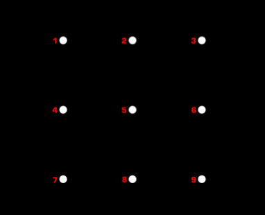

# Screen Locking Patterns

If you own an Android smartphone, you are familiar with the pattern you chose to lock your phone with. Every time, you pick up your phone and mechanically draw these lines on your screen, connecting the dots to form the unlock pattern. To unlock the device, you need to connect a sequence of dots/points in a grid by swiping your finger without lifting it as you trace the pattern through the screen.

The challenge is to implement a function that returns the number of possible patterns starting from a given first point, that have a given length. Assume the grid as the following:

For a function `countPatternsFrom(firstPoint, length)`, the parameter `firstPoint` is a number corresponding to the point in the grid (e.g.: `1`) where your patterns start, and the parameter `length` is an integer indicating the number of points (length) every pattern must have.

For example, `countPatternsFrom(3, 2)`, should return the number of patterns starting from `3` that have `2` two points. The return value, in this case, would be `5`, because there are 5 possible patterns:

(3 → 2), (3 → 4), (3 → 5), (3 → 6), and (3 → 8).

Bear in mind that this kata requires returning the **number** of patterns, **not the patterns themselves**, so you only need to count them. Also, **the name of the function might be different depending on the programming language used**, but the idea remains the same.

## Pattern Rules

1. In a pattern, the points **cannot be repeated**: they can only be used once, at
most.
  a. You can’t have a path as 2 → 3 → 4 → 2.
2. In a pattern, any two subsequent points can only be connected with **direct straight lines** in either of these ways:
  a. **Horizontally**: like (1 → 2).
  b. **Vertically**: like (4 → 7).
  c. **Diagonally**: like (I → E), as well as (2 → 9).
3. **Passing over a point between them that has already been 'used' as** like 5 → 4 → 7 → 3 passing over 5 from 7 → 3. Normally, you wouldn't be able to connect 7 → 3 going through 5 but, for the context of the exercise, you can have a pattern like 5 → 4 → 7 → 3, since the path from 7 → 3 is valid and 5 has been already used in the pattern.

## Unit test to validate the implementation

Check [patterns.test.ts](./patterns.test.ts) for the unit tests to validate the implementation.
